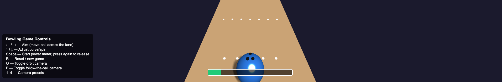
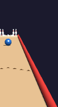
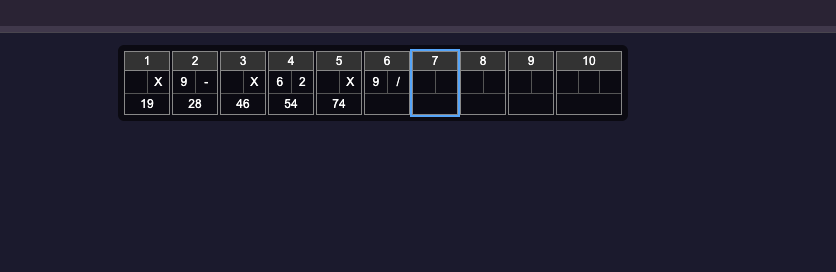

# Computer Graphics - Exercise 6 - Interactive Bowling Game

An interactive WebGL bowling game built with THREE.js (r128). It builds on the static
HW05 bowling alley and adds the full game layer: aiming and power controls, a rolling
ball with hand-written physics, pin collision and toppling, and complete 10-frame
scoring. There is no external physics engine — all motion and collision are integrated
by hand in the `animate()` loop using delta time.

## Demo
A short gameplay recording (aiming and releasing with the power meter, the ball
rolling and knocking down pins, a gutter ball, and the scorecard updating across
several frames including strikes and a spare):

- 🎥 [Gameplay video (Google Drive)](https://drive.google.com/file/d/1JnxDawv_qHLxmaf7LiI29fUd2Q4YlP02/view?usp=sharing) — also in the repo at [media/gameplay.mov](media/gameplay.mov)

| Aiming | Roll in progress | Scorecard |
|--------|------------------|-----------|
|  |  |  |

## Group Members
- Elizaveta Khanan

## How to Run
1. Clone this repository to your local machine.
2. Make sure you have Node.js installed.
3. Install dependencies: `npm install`
4. Start the local web server: `node index.js`
5. Open your browser at http://localhost:8000

## How to Play
1. **Aim** the ball left/right along the foul line with the arrow keys (optionally
   adjust curve/spin with Up/Down).
2. Press **Space** to start the oscillating power meter, then press **Space** again to
   lock in the power and release the ball.
3. Watch the ball roll, knock down pins (or fall into the gutter), and the scorecard
   update. The ball returns to the approach for the next roll automatically.
4. After the 10th frame a **Game Over** banner shows your final score. Press **R** for
   a new game at any time.

## Control Scheme
| Key | Action |
|-----|--------|
| ← / → | Aim — move the ball across the foul line |
| ↑ / ↓ | Adjust curve / spin (hook) |
| Space | Start the power meter; press again to lock power and release |
| R | Reset pins / start a new game |
| O | Toggle orbit camera (carried over from HW05) |
| F | Toggle follow-the-ball camera |
| 1–4 | Camera presets (overall, pin deck, approach, angled) |

The on-screen controls panel (bottom-left) lists these in-game.

## Implemented Systems
- **Aiming & power** — a small state machine (`aiming → power → rolling → resolving →
  next roll / game over`) gates input so aim and power are only accepted in the matching
  state. The power meter is an on-screen bar that oscillates between a min and max; the
  locked value maps to the release speed.
- **Ball physics** — release velocity is derived from aim direction and chosen power,
  then integrated each frame with `clock.getDelta()`. Rolling friction decelerates the
  ball, and gutter detection drops the ball into the gutter (0 pins) when it crosses the
  lane edge.
- **Pin collision & toppling** — sphere-vs-cylinder distance tests for ball–pin hits,
  plus pin-to-pin propagation so a falling pin can knock its neighbours. Knocked pins
  visibly topple (rotate and fall) and are marked down; standing pins are tracked
  accurately.
- **Scoring** — full 10-frame scoring with correct strike (X), spare (/), and
  open-frame bonus rules, including the third roll in the 10th frame. The running
  cumulative total renders in the scorecard.
- **Game flow** — end-of-roll detection counts fallen pins, updates the score, resets
  pins between frames, returns the ball to the approach, and indicates game over after
  the 10th frame.

## Bonus / Additional Features
- **Curve / spin (hook):** Up/Down arrows apply a small sideways adjustment to the
  launch direction.
- **Multiple camera presets:** keys 1–4 snap to overall, pin-deck close-up, approach,
  and angled views.
- **Follow-the-ball camera:** key `F` toggles a chase camera that smoothly trails the
  ball down the lane.
- **Bumper rails:** raised "inflatable"-style red bumpers sitting on top of each gutter.

## Known Issues / Limitations
- Physics is intentionally simplified and tuned for playability rather than realism;
  pin cascades and collision response are approximate, not physically exact.
- The hook/curve effect is subtle and meant as a light aiming aid, not a full spin model.

## External Assets
- THREE.js r128 (loaded via CDN) and the vendored `src/OrbitControls.js`.
- No external textures, models, or sound assets are used; all geometry and materials are
  generated procedurally in code.

## Technical Details
- Run the server with `node index.js`; access at http://localhost:8000.
- Built with THREE.js (r128) using simplified, hand-written physics (no physics engine).
- Express serves `index.html` at root and static files from `/src`.
